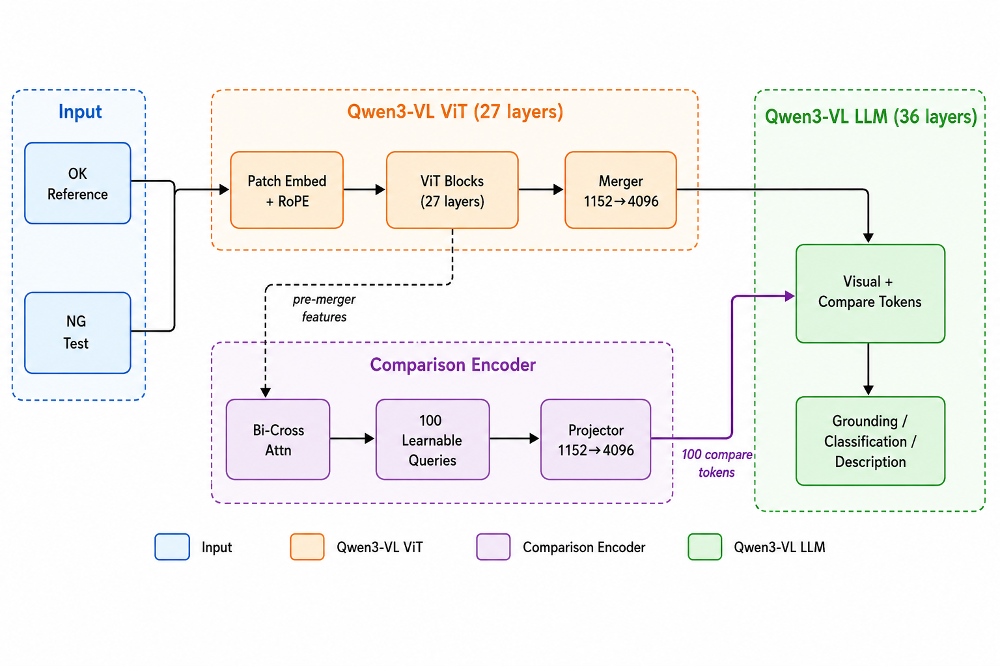
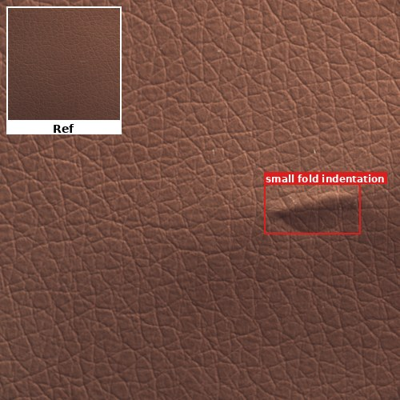
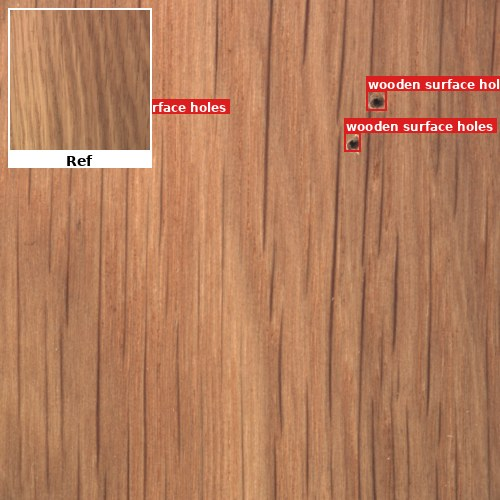
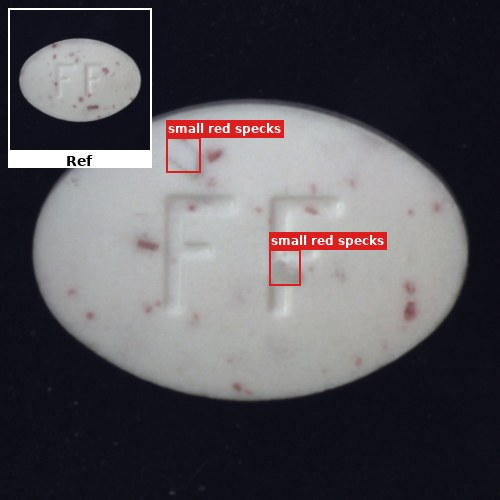

# AD-Compare

**Industrial Anomaly Detection via Comparison-Enhanced Multimodal LLM**

AD-Compare 是一个基于 Qwen3-VL-8B 的工业异常检测多模态大模型训练框架，通过引入 **Comparison Encoder（CE）** 模块实现参考图与测试图的对比推理，并提供完整的五阶段级联训练管线（含 GRPO 强化学习）和创新的自动评估方案。

## Highlights

1. **Comparison Encoder 模块** — 双向交叉注意力机制，100 个 learnable query，学习 OK（参考图）与 NG（测试图）之间的对比特征，通过 1152→4096 投影注入 LLM
2. **五阶段 Cascade 训练管线** — CE Pretrain → LLM LoRA → ViT+LLM LoRA → Multitask SFT → GRPO，逐步解冻模块，每阶段 LoRA 训完自动 merge
3. **GRPO 强化学习** — 基于规则奖励（IoU + 分类 + 格式 + 数量）优化定位精度和分类准确率
4. **自动 Reference 匹配评估** — 基于 embedding 的 OK 图自动检索（无需人工配对），实现端到端的 grounding 评估

## Architecture



## Installation

```bash
git clone https://github.com/chenyanghai123/AD-Compare.git
cd AD-Compare
pip install -e .
```

**依赖环境**：Python >= 3.10, CUDA >= 12.1, transformers >= 4.57.0

## Data Format

训练数据为 JSON 格式，每条样本包含 `messages` 和 `images` 字段：

```json
{
  "messages": [
    {
      "role": "user",
      "content": "<image><image>Given the normal reference (first), identify and localize defects in the second image.\nFormat: [{\"bbox_2d\": [x1,y1,x2,y2], \"label\": \"type\"}]"
    },
    {
      "role": "assistant",
      "content": "[{\"bbox_2d\": [120, 80, 350, 260], \"label\": \"scratch\"}]"
    }
  ],
  "images": ["/path/to/ok_reference.jpg", "/path/to/ng_test.jpg"]
}
```

- `<image>` 占位符对应 `images` 列表中的图片顺序
- bbox 坐标在 [0, 1000] 归一化空间（Qwen-VL 惯例）

## Quick Start — Inference

```python
import torch
from ad_compare import (
    AdCompareQwen3VLConfig,
    AdCompareQwen3VLForConditionalGeneration,
)
from ad_compare.dataset_ad_compare import load_processor

model_path = "./checkpoints/stage3_multitask_sft_merged"
config = AdCompareQwen3VLConfig.from_pretrained(model_path)
model = AdCompareQwen3VLForConditionalGeneration.from_pretrained(
    model_path, config=config, torch_dtype=torch.bfloat16, attn_implementation="sdpa"
).eval().cuda()
processor = load_processor(model_path)

# Build input
messages = [{"role": "user", "content": [
    {"type": "image"},  # OK reference
    {"type": "image"},  # NG test
    {"type": "text", "text": 'Given the normal reference (first), identify and localize defects in the second image.\nFormat: [{"bbox_2d": [x1,y1,x2,y2], "label": "type"}]'}
]}]
text = processor.apply_chat_template(messages, tokenize=False, add_generation_prompt=True)
from PIL import Image
images = [Image.open("ok.jpg"), Image.open("ng.jpg")]
inputs = processor(text=[text], images=images, return_tensors="pt", padding=True)
inputs = {k: v.to(model.device) if isinstance(v, torch.Tensor) else v for k, v in inputs.items()}

with torch.inference_mode():
    out = model.generate(**inputs, max_new_tokens=512, do_sample=False)
pred = processor.tokenizer.decode(out[0, inputs["input_ids"].shape[1]:], skip_special_tokens=True)
print(pred)
```

## Training Pipeline

### Step 0: Build Initial Checkpoint

从 Qwen3-VL-8B-Instruct 注入 CE 模块权重：

```bash
bash scripts/run_build_init.sh
```

### Step 1-5: Five-Stage Cascade Training

```bash
# 全流程一键启动（Stage 0 → 1 → 2 → 3 → 4，含自动 LoRA merge）
bash scripts/run_pipeline.sh

# 或单独运行某个阶段
bash scripts/run_stage0.sh   # CE pretrain (freeze ViT+LLM)
bash scripts/run_stage1.sh   # LLM LoRA + CE
bash scripts/run_stage2.sh   # ViT LoRA + LLM LoRA + CE
bash scripts/run_stage3.sh   # Multitask SFT (all unfrozen)
bash scripts/run_stage4.sh   # GRPO reinforcement learning
```

**训练配置**：修改 `configs/stage*.yaml` 中的路径（`model_name_or_path`, `data_path`, `output_dir`）

**GPU 需求**：8×A800-80G（ZeRO-2），可在 `scripts/run_stage*.sh` 中调整卡数

### Training Stages Overview

| Stage | 训练模块 | 冻结模块 | DeepSpeed | 备注 |
|-------|---------|---------|-----------|------|
| 0 | CE | ViT, LLM | ZeRO-2 | CE 预训练，学习对比表示 |
| 1 | LLM (LoRA), CE | ViT | ZeRO-2 | 注入语言理解能力 |
| 2 | ViT (LoRA), LLM (LoRA), CE | — | ZeRO-2 | 视觉+语言联合微调 |
| 3 | All | — | ZeRO-2 | 多任务 SFT（grounding + cls + desc） |
| 4 | LLM (LoRA) | ViT, CE | ZeRO-2 | GRPO 强化学习（IoU+cls 奖励） |

## Evaluation Pipeline

辅助功能：无需手动为每张 NG 图指定参考 OK 图，通过 embedding 相似度自动从 OK 池检索最佳参考。

```bash
# 设置环境变量
export EVAL_DATA_ROOT=/path/to/eval_dataset
export MODEL_PATH=./checkpoints/stage3_multitask_sft_merged

# 一键运行完整评估
bash scripts/run_eval.sh
```

**评估流程**：

| Step | Script | 功能 |
|------|--------|------|
| 1 | `01_extract_ok_features.py` | 抽取 OK 池灰度 embedding (64×64 flatten → L2-norm) |
| 2 | `02_retrieve_reference.py` | 为每张 NG 检索 cosine top-1 OK reference |
| 3 | `03_infer_grounding.py` | 批量 grounding 推理（支持断点续跑） |
| 4 | `04_compute_map.py` | 坐标对齐 + class-agnostic mAP 计算 |
| 5 | `05_visualize_samples.py` | 抽样可视化 GT vs PD |
| 6 | `06_make_report.py` | 生成完整评估报告 |

**输出指标**：mAP@0.5, mAP@[.5:.95], Precision, Recall, F1, PR curve, IoU histogram

## Project Structure

```
AD-Compare/
├── ad_compare/                    # 核心模型包
│   ├── modeling_ad_compare.py     # CE + Qwen3-VL 模型架构
│   ├── processing_ad_compare.py   # Processor（compare token 扩展）
│   ├── dataset_ad_compare.py      # Dataset + Collator
│   ├── dataset_grpo.py            # GRPO 数据集
│   ├── reward_functions.py        # GRPO 奖励函数
│   └── build_initial_checkpoint.py
├── configs/                       # 五阶段训练配置 (YAML)
├── deepspeed/                     # DeepSpeed ZeRO 配置
├── scripts/                       # Shell 启动脚本
├── tools/                         # 训练/推理/merge 入口
│   ├── train.py                   # Stage 0-3 统一训练入口
│   ├── train_grpo.py              # Stage 4 GRPO 训练入口
│   ├── infer.py                   # 推理脚本
│   └── merge_lora.py              # LoRA merge 工具
├── eval/                          # 评估 pipeline（6 步）
├── requirements.txt
└── setup.py
```

## Model Weights

本仓库仅包含代码和配置。模型权重获取方式：

1. **基座模型**：从 [Qwen3-VL-8B-Instruct](https://huggingface.co/Qwen/Qwen3-VL-8B-Instruct) 下载
2. **初始 checkpoint**：运行 `scripts/run_build_init.sh` 从基座构建
3. **训练后权重**：按四阶段训练管线训练获得，（训练好的版本：https://hf-mirror.com/chenyanghai123/stage3_multitask_sft_merged）
                  (GRPO定位强化版本：https://huggingface.co/chenyanghai123/AD-Compare-Qwen3-VL-8B)

## Examples

以下为 AD-Compare 模型的推理示例，覆盖三种任务类型。

> 每张图的左上角缩略图为正常参考图（Ref），红框为模型预测的缺陷位置。bbox 坐标在 0-1000 归一化空间。

---

### 示例1：皮革折痕

| 检测结果 | 任务输出 |
|---|---|
|  | **任务一：缺陷定位（Grounding）**<br>bbox_2d: [660, 458, 900, 585]<br>label: small fold indentation<br><br>**任务二：缺陷分类（Classification）**<br>A. Yes（有缺陷）✓<br><br>**任务三：缺陷描述（Description）**<br>A small, raised fold disrupting the leather's natural grain pattern. Located in the middle-right region. |

---

### 示例2：木板多孔洞

| 检测结果 | 任务输出 |
|---|---|
|  | **任务一：缺陷定位（Grounding）**<br>① [155, 227, 220, 307] · wooden surface holes<br>② [688, 265, 721, 302] · wooden surface holes<br>③ [732, 181, 773, 220] · wooden surface holes<br><br>**任务二：缺陷分类（Classification）**<br>A. Yes（有缺陷）✓<br><br>**任务三：缺陷描述（Description）**<br>Three distinct holes with dark centers and rough edges appear on the wood surface. These holes break the natural wood grain continuity seen in the reference image. The defect is located in the top-left region of the image. Severity is assessed as minor. Likely cause: Wood boring insects or mechanical damage during processing. |

---

### 示例3：药片红色污染点

| 检测结果 | 任务输出 |
|---|---|
|  | **任务一：缺陷定位（Grounding）**<br>① [333, 275, 401, 345] · small red specks<br>② [538, 498, 600, 571] · small red specks<br><br>**任务二：缺陷分类（Classification）**<br>A. Yes（有缺陷）✓<br><br>**任务三：缺陷描述（Description）**<br>Small dark specks and a white scratch on the pill surface. Located in the center region. |

---

## License

Apache-2.0
